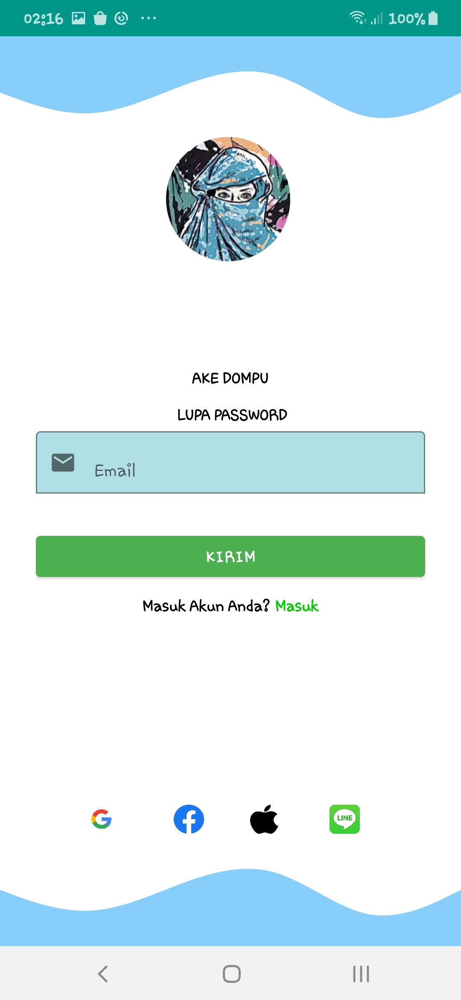
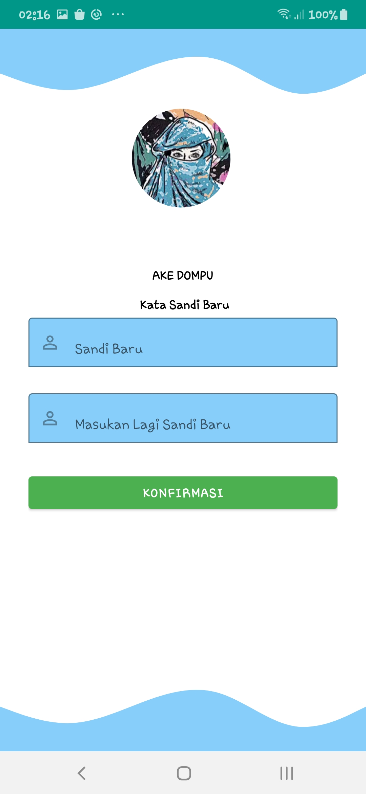
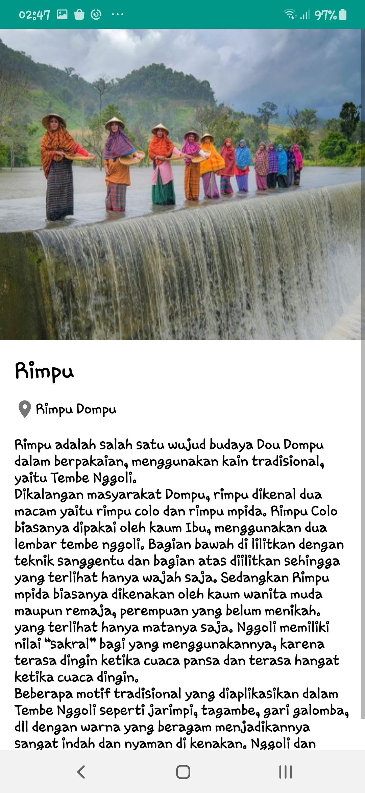

# UTS MOBILE

## Tujuan Pembelajaran

1. MERUJUK PADA SETIAP PERTEMUAN,SEMUA MATERI SUDAH LENGKAP ADA DALAM SATU APLIKASI YANG TELAH DIBUAT.

## SISTEM SUDAH MENCAKUP KESELURUHAN PERTEMUAN.
## 1. PARADIGMA PEMROGRAMAN MOBILE
## 2. ARSITEKTURE ANDROID
## 3. SETUP ANDROID STUDIO
## 4. LAYOUT,ACTIVITY
## 5. WIDGET
## 6. MULTIPLE ACTIVITY (NAVIGATION)
## 7. LISTVIEW
## 8. RECYCLEVIEW
## 9. ANIMASI DAN MULTIMEDIA
## 10. DATA BINDING
## 11. MVVM

*** Hasil ***

## SISTEM LOGIN
## 1. SPLASH SCREEN

## 2. LOGIN

## . LUPA PASSWORD

## 4. KIRIM EMAIL LUPA PASSWORD

## 5. MASUKAN KODE

## 6. MEMBUAT KATA SANDI BARU

## 7. DAFTAR 

## 8. LOGIN DENGAN GOOGLE

## 9. TAUTAN BERHASIL DENGAN GOOGLE

## 10. LOGIN DENGAN FACEBBOOK

## 11. TAUTAN BERHASIL DENGAN FACEBOOK

## 12. LOGIN DENGAN APPLE

## 13. TAUTAN BERHASIL DENGAN APPLE

## 14. LOGIN DENGAN LINE

## 15. TAUTAN BERHASIL DENGAN LINE

## 16. HOME MENU

## 17. SOSIAL

## 18. PEKERJAAN

## 19. RUMAH ADAT

## 20. TRADITIONAL GAME

## 21. KEBUDAYAAN 

## 22. MAKANAN TRADITIONAL 

## 23. VIDEO TENTANG DOMPU

## 24. POPULER WISATA SCROOL HORIZONTAL GAMBAR

## 25. MENU FAVORIT VIEW

## 26. NANGGA TUMPU

## 27. DORO WADU NAE

## 28. PANTAI LAKEY

## 29. WADU JAO

## 30. SARAE NDUHA

## 31. BERANDA 

## 32. SCROOL HORIZONTAL DAN VERTIKAL

## 33. WISATA DOMPU LIHAT SEMUA

## 34. LIHAT WISATA LAKEY

## 35. LIHAT WISATA NANGATUMPU

## 36. LIHAT WISATA PULAU SATONDA

## 37. LIHAT WISATA DORO WADU NAE

## 38. LIHAT WISATA GUNUNG TAMBORA

## 39. LIHAT RUMAH ADAT

## 40. LIHAT AIR TERJUN OI PANcA

## 41. LIHAT SEMUA BUDAYA

## 42. LIHAT BUDAYA TARIAN ADAT 

## 43. LIHAT BUDAYA MBAJU KURU

## 44. LIHAT BUDAYA RIMPU

## 45. LIHAT BUDAYA TEMBE NGGOLI

## 46. LIHAT BUDAYA PACUAN KUDA

## 47. AKUN

## 48. KELUAR

